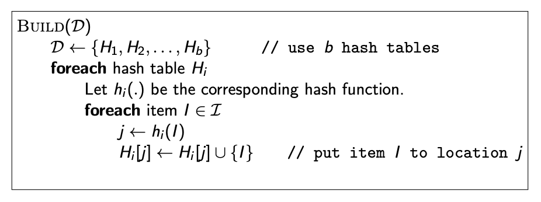
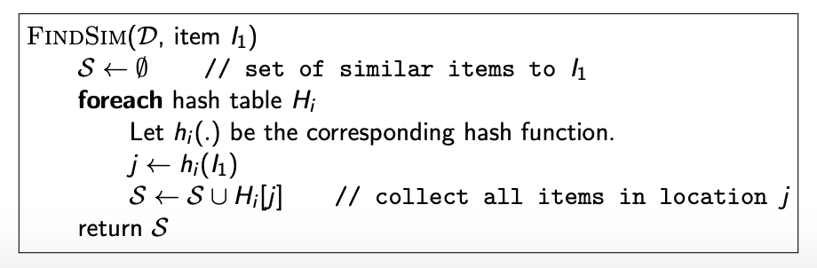

# Similar Questions - Recommendation System

Algorithms using Jaccard similarity and minhashing to identify questions from a list that are similar to one another.

## Jaccard Similarity (The simple approach)

Given a collection of items I and an arbitrary item i, we want to find items in I that are similar to i.

## Minhashing (The performant approach)

Minhashing is a technique for quickly estimating how similar two sets are. The scheme was invented by Andrei Broder, and initially used in the AltaVista search engine to detect duplicate web pages and eliminate them from search results.

Here, the locality sensitive hashing algorithm is implemented, with x = 0.6, b = 14 and r = 6, where b is the number of hash tables and r is the size of the minhash signature.

I use the linear hash function h(x) = (a*x +b) mod p, where a,b are two random 64-bits integers and p is a 64-bit prime integer. I set p = 15373875993579943603 for all hash functions. 

### Pseudo-code of the algorithm

