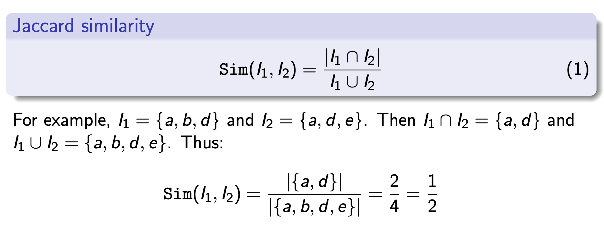

# Similar Questions - Recommendation System

Algorithms using Jaccard similarity to identify questions from a list that are similar to one another.

## Jaccard Similarity

Given a collection of items I and an arbitrary item i, we want to find items in I that are similar to i.

